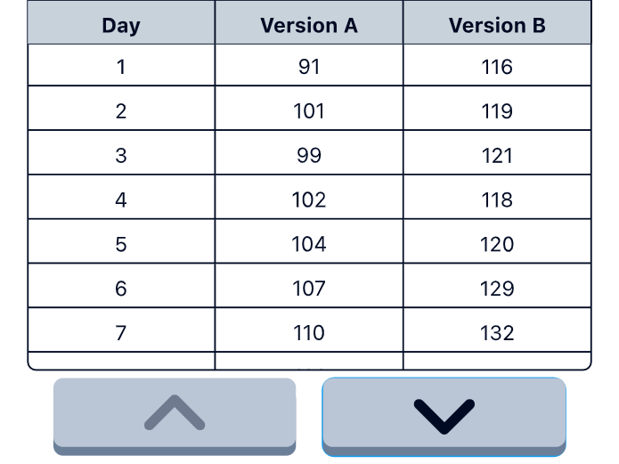
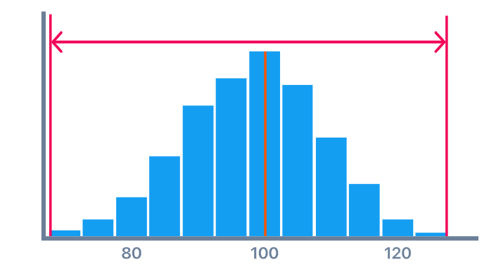
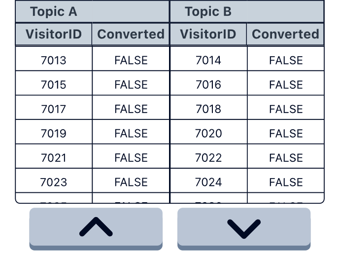

# A/B-тестирование на основе искусственного интеллекта
Изучите основы A/B-тестирования и анализа данных в этом вводном курсе. Узнайте, как планировать эксперименты, интерпретировать результаты и использовать данные для принятия обоснованных решений, основанных на данных. Идеально подходит для новичков, желающих улучшить свои аналитические навыки и добиться эффективных бизнес-результатов.

### Оглавление:
#### [Что такое A/B-тестирование?](#wtf)
#### [Результаты A/B-тестирования](#result)
#### [Тестирование рекламы](#ad)
#### [Тестирование контента](#content)
#### [ipsum](#lorem)
#### [ipsum](#lorem)

### [Назад к оглавлению](#back)

##  

## Что такое A/B-тестирование?

- Вы можете использовать **A/B-тестирование**, чтобы улучшить свой продукт.
- Измеряемые вами различия могут быть обусловлены **случайными вариациями**.

Знаете ли вы, что Google экспериментировал с 41 оттенком синего, чтобы найти цвет, который получает больше всего кликов?

Компании используют **эксперименты**, чтобы сделать свою продукцию максимально эффективной. На этом уроке вы узнаете о типе эксперимента: **A/B-тесте**.

Экологическая благотворительная организация тестирует две версии домашней страницы своего веб-сайта и ежедневно отслеживает количество новых волонтеров для обеих версий.

Давайте начнем визуализировать количество новых ежедневных волонтеров с помощью версии А. Визуализация показывает количество новых волонтеров колеблется вверх и вниз.

**Колебания** (взлеты и падения) ваших данных естественны. Эти **случайные изменения** вызваны непредсказуемыми и неконтролируемыми факторами, такими как будние дни, и выходные, поведением людей, трафиком сайта.

Важные **сигналы** могут быть скрыты в этом случайном шуме. Гистограммы помогают измерить силу сигнала среди всего шума.

На гистограмме колебания происходят вокруг среднего значения 100.

Далее давайте посмотрим, как сравниваются версии A и B.

Визуализация показывает, что версия B, похоже, вносит больше волонтеров.

Мы наблюдали колебания данных. Насколько мы можем быть уверены в том, что различия, наблюдаемые между версиями А и В, не случайны?

Всегда есть вероятность, что вы примете неправильное решение при использовании данных экспериментов. Сравнение гистограмм — хороший способ получить больше уверенности.

Изучение показателей центра и разброса поможет вам понять, насколько вероятны наблюдаемые вами различия случайны.

Чем больше относительная процентная разница (𝚫, дельта) между средними значениями, тем больше вы можете быть уверены в том, что ваши результаты действительно различаются.

Дельта (𝚫) приведенного выше примера равна двадцати процентам. Т.е. это величина в процентах, которая показывает на сколько больше добровольцев привлекает Версия Б по сравнению с версией А.

Чем больше совпадений вы наблюдаете на гистограммах, тем меньше вы можете быть уверены в существенных различиях в данных вашего эксперимента.

### [Назад к оглавлению](#back)

## Результаты A/B-тестирования

- **Тест статистической значимости** помогает принимать решения на основе данных.
- Небольшое **значение p** дает более высокую статистическую значимость, а значит, большую уверенность в наблюдаемых различиях.

Многие компании используют A/B-тестирование для улучшения своих продуктов, но мало кто по-настоящему понимает, как правильно анализировать результаты.

К концу этого урока вы присоединитесь к элитной группе профессионалов, которые смогут уверенно и точно интерпретировать данные A/B-тестирования!

Вы продолжите анализировать данные благотворительной организации по защите окружающей среды, чтобы принять решение на основе данных, учитывающее неопределенность.

Тип эксперимента, который обычно включает два варианта, называется A/B-тест.

Любой эксперимент начинается с гипотезы.

Гипотеза – это обоснованное предположение или предсказание результата эксперимента.

Версия что версия В привлекает больше волонтеров, чем версия А - могла бы стать хорошей гипотезой для экологического благотворительного эксперимента.

Интерпретация результатов A/B-теста поможет вам принять или отвергнуть вашу гипотезу и принять решение на основе данных.

Одна маленькая ошибка может привести к неверным выводам и потерям для вашего бизнеса. Как вы можете убедиться, что принимаете правильное решение?

Чем меньшее перекрытие вы наблюдаете на гистограммах, тем больше вы можете быть уверены в существенных различиях в данных вашего эксперимента.

**Значение вероятности (p-value, значение p)** говорит вам, насколько вы можете быть уверены в существенных различиях в своем эксперименте. P-value могут быть рассчитаны аналитиком данных, статистиком или вами самим с помощью ИИ.

P-value является результатом **статистического теста**. Он используется для определения вероятности того, что наблюдаемые результаты являются случайными.

Небольшое p-value показывает, что вы можете быть более уверены в различиях в результатах.

Чем меньше значение p, тем больше вы можете быть уверены в том, что ваши результаты демонстрируют статистически значимые различия. 

Правда или ложь?

Небольшое значение p показывает, что наблюдаемые вами различия, скорее всего, обусловлены случайными вариациями или случайностью. - Ложь.

Порог, называемый **уровнем значимости**, должен быть установлен в качестве критерия для принятия решений по экспериментам. 5% — популярный уровень значимости, используемый во многих отраслях.

Результаты экологической благотворительности показывают p-значение 3%. Что бы вы посоветовали?
- [ ] Запустите эксперимент еще раз
- [x] Используйте выигрышную версию B

### [Назад к оглавлению](#back)

## Тестирование рекламы

- Принятие/отвержение **гипотезы**
- Использование ИИ для расчета **коэффициентов конверсии**
- Использование ИИ для расчета **статистической значимости**

На сегодняшнем конкурентном рынке навыки работы с данными необходимы для роста и устойчивости любой компании.

В этом упражнении вы возьмете на себя роль владельца малого бизнеса, заинтересованного в оптимизации рекламы в социальных сетях.

Вы недавно начали свой бизнес по созданию контента. Чтобы привлечь больше людей на подписку, вы размещаете платную рекламу в социальных сетях.

Вы тестируете две разные версии рекламы. Этот тип эксперимента называется **А/Б тест**.

Любой эксперимент начинается с гипотезы. Гипотеза **"Подписки А > Подписки Б"** могла бы быть хорошей для этого эксперимента.

Вы провели A/B-тест, и теперь пришло время проанализировать результаты. 

Типом данных значений в поле «Подписка» (Subscribed) является **булево значение**.

**Коэффициенты конверсии (conversion rates)** — это проценты, которые обычно используются в цифровом маркетинге для оценки эффективности трафика веб-сайта и маркетинговых кампаний.

ИИ может помочь вам рассчитать коэффициенты конверсии. Если мы загрузим ему данные из таблицы, и дадаим задание, получим ответ:
- Группа А: 7%
- Группа Б: 4%

**Коэффициент конверсии** — это сводная статистика, как и среднее значение. Он рассчитывается как процент пользователей, выполнивших желаемое действие.

По сравнению с группой Б, абонентов в **группе А больше на 75%**. Расчеты показывают, что коэффициент конверсии выше у пользователей группы А. Мы также рассчитали относительную процентную разницу 𝚫 (путем пропорции А и В).

Достаточно ли у вас доказательств, чтобы принять или отвергнуть гипотезу эксперимента?

Всегда существуют непредсказуемые и/или неконтролируемые факторы, влияющие на результаты ваших экспериментов. Это переводится в **случайное изменение или шум**.

Имея дело с неопределенностью, вы можете принять решение на основе данных, рассчитав **p-value**. 

Меньшее **p-value** означает, что различия между двумя версиями с **меньшей вероятностью** вызваны **случайными вариациями**.

Объяснение:  
- **p-value** — это статистическая мера, используемая для проверки гипотез. Она показывает вероятность того, что наблюдаемые различия между версиями произошли случайно.
- A smaller p-value (меньшее значение p-value) указывает на то, что разница между двумя версиями **менее вероятно** (less likely) объясняется **случайными вариациями** (random variation).
- Таким образом, если p-value достаточно маленькое (например, меньше 0.05), это свидетельствует о том, что различия **статистически значимы**, и они, скорее всего, вызваны **реальными эффектами**, а не случайностью.

**p-value** является результатом **теста статистической значимости**.

Объяснение:  
- **p-value** — это числовой результат, который вычисляется при проведении статистического теста значимости.
- **Statistical significance test** — это метод анализа данных, с помощью которого определяют, насколько вероятно, что наблюдаемые различия вызваны не случайностью, а реальными эффектами.
- Таким образом, **p-value** — это ключевая метрика, помогающая интерпретировать результаты такого теста.

**ИИ** может помочь вам найти подходящий статистический тест для вашего эксперимента и данные для расчета **значения p** (p-value).

**Промпт ИИ**:  
Предложите тест статистической значимости для этого эксперимента и данных. Затем используйте его для расчета p-value.

**Ответ ИИ**:
Наиболее подходящим статистическим тестом в этом контексте является Z-тест для двух долей. Этот тест используется для определения того, существует ли значительная разница между долями двух групп.
Этот тест дает нам значение p 0,18 (18% выражено в процентах).

Таким образом, **p-value**, равное 0,18 (18%), означает, что вероятность того, что наблюдаемые различия являются случайными - **не очень мала!**

О чем вам говорит это **p-value**? Есть ли у вас достаточно доказательств того, что одна версия работает лучше другой? 

Иногда вы можете получить высокие **p-value**, если не собрали достаточно данных. В некоторых ситуациях продолжительность эксперимента немного дольше и сбор большего количества точек данных могут помочь вам получить больше уверенности.

Представьте, что вы решили провести тест еще 2 недели, чтобы собрать больше данных. Вы выполняете статистический тест еще раз и получаете **p-value** равным 0,03 (3%). И что тогда означает такое значение?..

### [Назад к оглавлению](#back)

## Тестирование контента

- Принятие/отвержение **гипотезы**
- Расчет **коэффициентов конверсии**
- Принятие решения **на основе данных**

Компании используют эксперименты для определения наиболее эффективных стратегий. На этом уроке вы получите практический опыт работы с результатами тестирования контента.

Представьте, что вы — менеджер бизнеса по продаже коттеджей. Вы публикуете контент в своем блоге, чтобы привлечь клиентов. Набор данных включает в себя результаты теста контента, который вы проводили по двум разным темам.

Вы считаете, что тема вашего поста в блоге имеет значение и что одна тема приводит к большему количеству заказов, чем другая. Это ваша **гипотеза**.

Если внизу поста вы разместите кнопку «Забронировать сейчас». Процент читателей, которые нажимают на эту кнопку, – это ваш показатель **коэффициента конверсии**.

**ИИ-помощник** имеет доступ к полному набору данных с результатами A/B-тестов. Используйте ИИ для расчета коэффициентов конверсии по двум различным темам:

**Промпт ИИ:**  
Рассчитай коэффициенты конверсии для тем A и B

**Ответ ИИ:**
Чтобы рассчитать коэффициент конверсии, вы делите количество конверсий на общее количество посетителей по каждой теме и умножаете на 100, чтобы получить процент.

По теме А:
Коэффициент конверсии = (Количество конверсий по теме А / Общее количество посетителей по теме А) * 100
Коэффициент конверсии = (10/100) * 100
Коэффициент конверсии = 10%

По теме Б:
Коэффициент конверсии = (Количество конверсий по теме B / Общее количество посетителей по теме B) * 100
Коэффициент конверсии = (10,4 / 100) * 100
Коэффициент конверсии = 10,4%

Таким образом, коэффициенты конверсии для темы A и темы B составляют 10% и 10,4% соответственно.

Таким образом, на **дельта равной 4%** - больше посетителей совершило конверсию в версии Б по сравнению с версией А.

Следоваетльно, у вас **недостаточно** уверенности в том, что одна тема работает лучше, чем другая.

Следующим хорошим шагом, чтобы принять или отвергнуть гипотезу вашего эксперимента и принять решение, основанное на данных - будет запустить **тест статистической значимости**.

Проверка статистической значимости приведет к **p-value**.

Давайте воспользуемся ИИ, чтобы найти подходящий **статистический тест** и вычислить **p-value**.

**Промпт ИИ**:  
Предложи тест статистической значимости для этого эксперимента и данных, а затем используй его для расчета p-value.

**Ответ ИИ**:  
Наиболее подходящим статистическим тестом в этом контексте является Z-тест для двух долей. Этот тест используется для определения того, существует ли значительная разница между долями двух групп. Этот тест дает нам значение p равным 0,88 (88% выражено в процентах).

Высокое **p-value** (88%) говорит о том, что вы **не можете быть уверены в различиях** между темами A и B.

Какое решение вы бы приняли? Приняли бы вы или отвергли первоначальную гипотезу эксперимента?

Различия, наблюдаемые в этом тесте, **не являются** статистически значимыми. 

Результаты этого теста являются ярким примером различий, которые не являются статистически значимыми. В этом случае нет необходимости позволять тесту работать дольше, чтобы собрать больше данных, **потому что дельта слишком мала, а p-value - слишком высоко**.

